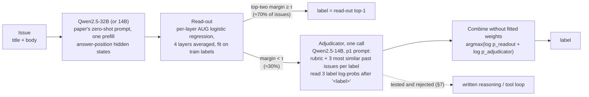

# Can an agent beat SetFit? An agentic-IRC proposal for the 11-project benchmark

Status: final write-up, 2026-09-24. The pilot was stopped early at the user's request; §7.6 lists what did not run. Post-deadline research; nothing here goes into the SANER paper.
Code: [scripts/experiments/agentic/](../scripts/experiments/agentic/). Pilot outputs (lab machine only): `~/llm-labler/results/issues11k/exploration/agentic/`.

## 0. Verdict

**Agency does not pay for its cost on this benchmark.** That holds for Qwen2.5-14B, and on a 50-issue check it holds for a frontier model too. The available gain comes from combining a trained classifier with *one* LLM pass on the hard cases, and the strongest form of that combination is non-agentic.

Evidence from the dev pilot. The model is Qwen2.5-14B. R is SetFit's 300 lowest-margin dev issues, where SetFit is right 64.7% of the time.

| Arm on R | Routed accuracy | Full-dev macro F1 vs SetFit, fused with SetFit [95% CI] | Seconds per routed issue |
|---|---:|---:|---:|
| One call, balanced contrastive examples (p1) | 0.683 | **+0.021 [+0.006, +0.036]** | 0.55 |
| The same with written reasoning first (p3) | 0.663 | +0.008 [−0.007, +0.023] | 6.9 |
| The same with tools, ≤ 3 calls: the agent (p4) | 0.657 | +0.013 [−0.001, +0.028] | 8.7 |
| Replay: the agent's own tool outputs in one prompt (p5) | 0.683 | +0.019 [+0.004, +0.034] | 0.57 |

- **Every added generation step made the result worse and 12–15× slower.** The agent lost to its replay control by 2.7 points of routed accuracy (CI [−6.3, +1.0]). It used its tools on only 6 of 300 issues. In practice it wrote a justification and then answered, and that step is what hurt: written reasoning alone (p3) lost 1.7 points.
- **A frontier model does not rescue agency.** Claude subagents had the same four tools over the same training-side data. They used them on 17 of 50 audited issues and changed their own answer on one, for the worse. The agent scored 0.80 with tools, 0.82 with the same context and no tools, and 0.86–0.90 reading the issue text alone.
- **The hard slice has a ceiling near 80%.** On about a fifth of it, two Claude reads agree with each other on a label that differs from gold, and flag most of those cases as ambiguous (§7.4).
- **The parallel rag_next study found the better lever** ([RAG_NEXT_STUDY.md](RAG_NEXT_STUDY.md)). A linear read-out of Qwen's zero-shot answer-position state scores **0.845** test macro F1 at 32B, +0.035 over SetFit-PS, and the gain holds when projects rather than issues are resampled. At 14B it scores 0.828. It needs one prefill per issue and no generation. The same study found that a combiner fitted on dev over-predicted bug on test. Any fused cascade, including this one, carries that risk.

**Against the bars.**
- *Per-issue agent (design A, or B with its tool tier).* It will not beat SetFit-PS (0.810) or LoRA-14B (0.785). At the same model size it trails the paper's own RAGTAG prompt on the routed slice (0.657 vs 0.673). Confidence: high for Qwen2.5 up to 14B, moderately high in general given the Claude check.
- *Routed cascade, SetFit plus a one-call adjudicator.* It should beat all three bars on test by about +0.01 to +0.02 over SetFit if its fusion transfers. On dev it gains +0.021 with fitted weights and +0.012 without. Confidence: moderate. Dev is easier than test, and a dev-fitted combiner has already failed to transfer once.
- *Decision-state read-out (rag_next).* It has already beaten all three on test.

**Recommendation.** Do not build a per-issue agent. Adopt the decision-state read-out as the classifier. The one agentic idea worth keeping is routing: spend an LLM call only on the read-out's least-confident issues, and combine the two with a rule that has no fitted weights. Test that tier first (§9, about 5 GPU-minutes) and drop it unless it adds at least +0.005 on dev. The most likely outcome is that the read-out already knows what the adjudicator knows. rag_next found that RAG label scores add at most +0.002 on top of it.

**What would change my mind.** Two results would:
- An agent, with any model, beating its replay control by at least 2 points of routed accuracy on 300 or more dev issues.
- A convention tool (`label_stats`, or an offline labelling guide) fixing the errors the read-out leaves in the template-driven projects: ansible, kubernetes, tensorflow and opencv.

## 1. Scope, bars, and the rules this study followed

The task is to label a GitHub issue as `bug`, `feature` or `question` from its title and body. The benchmark has 11 projects × 600 issues, balanced, and a temporal split. Within each (repo, label) group of 200 issues, the older 100 are train and the newer 100 are test. Every score is pooled macro F1 over the 3,300 test issues, computed by concatenating first and evaluating once.

Bars, re-verified from the per-issue predictions in `results/issues11k/` (95% bootstrap CIs, 1,000 resamples):

| Method | Macro F1 | 95% CI |
|---|---:|---|
| SetFit, issue-adapted MPNet, PS | **0.810** | [0.797, 0.824] |
| SetFit, generic MPNet, PS | 0.805 | [0.792, 0.819] |
| LoRA Qwen-14B, PA (best LLM) | 0.785 | [0.771, 0.800] |
| BRAGTAG PS 32B / 14B / 7B / 3B | 0.781 / 0.756 / 0.738 / 0.714 | |
| RAGTAG PS 32B / 14B / 7B / 3B | 0.767 / 0.732 / 0.718 / 0.697 | |
| RoBERTa-base, PA | 0.771 | [0.756, 0.785] |
| VOTAG PS k=15 | 0.595 | [0.578, 0.614] |

Protocol:

- **Test data.** No design decision below uses test labels. The test-set numbers in §2 are descriptive: oracle ceilings, disagreement structure, and where the errors fall in the archived predictions. The paper already reports these methods, so the numbers only size the opportunity. Nothing in this study was evaluated on test.
- **Dev split.** Pilots use the rag_next study's dev split (`splits/pool.csv`): the newest 30 train issues of each (repo, label) group, 990 in all. The older 2,310 train issues (`inner`) act as the training set and the retrieval index. Both explorations share the split, so their numbers are comparable.
- **Pilot limits.** Every LLM arm stayed within 300 dev issues and 2 GPU-hours. SetFit scored all 990 dev issues, which takes seconds.

## 2. Headroom: where could agency gain anything?

Script: [headroom_agentic.py](../scripts/experiments/agentic/headroom_agentic.py). Full output: `exploration/agentic/headroom/headroom_agentic.txt`. It reads the archived test predictions through a snapshot of the rag_next aggregation (`master_preds.parquet`).

### 2.1 How much error is recoverable at all?

SetFit-PS gets 626 of 3,300 issues wrong (19.0%). Three kinds of evidence size the part no text-only method can recover:

- **Consensus errors.** Eight strong methods from four families are *all* wrong on 166 issues (5.0%): SetFit (issue-adapted and generic MPNet), RoBERTa, LoRA-14B and -32B, BRAGTAG-32B and -14B, and RAGTAG-32B. Those 166 are 79 true questions, 62 features and 25 bugs. The commonest consensus errors are question → bug (47), feature → bug (42) and question → feature (32). The share rises to 8.9% if issues that only one method gets right are counted, and to 13.4% for two.
- **The paper's failure analysis.** It covers 150 test errors of the Qwen-32B methods: 77% were a question or feature request filed under a bug template, 13% had hybrid intent, and 9% were label noise. Template errors can be recovered in principle, since the content supports the label. Label noise cannot.
- **The frontier-reader audit on dev (§7.4).** Claude reads 0.79–0.80 of SetFit's hard slice correctly from the text alone, where SetFit gets 0.67. Two Claude runs agree with each other against gold on 19 of 100 items, mostly flagged ambiguous. So about a fifth of the hard slice is label noise or project convention.

Reading: 5–9% of test issues are out of reach of every method family we have. Recovering all the other errors would give macro F1 ≈ 0.95, so SetFit sits 14 points below that ceiling. Plenty of error is recoverable in principle. The question is which mechanism can reach it.

### 2.2 Oracle ceilings

If each issue were resolved correctly whenever either of two methods is right:

| SetFit-PS + … | Disagree | SetFit right on disagreement | Other right | Neither | Oracle macro F1 | Always trust other on disagreement |
|---|---:|---:|---:|---:|---:|---:|
| SetFit generic-MPNet | 12.4% | 48% | 44% | 8% | 0.865 | 0.805 |
| RoBERTa PA | 15.6% | 58% | 35% | 8% | 0.864 | 0.771 |
| VOTAG PS k15 | 37.7% | 74% | 18% | 8% | 0.878 | 0.595 |
| Zero-shot Qwen-32B | 24.6% | 68% | 25% | 8% | 0.870 | 0.689 |
| BRAGTAG-7B | 25.1% | 61% | 28% | 11% | 0.880 | 0.755 |
| BRAGTAG-32B | 21.0% | 55% | 34% | 12% | 0.881 | 0.798 |
| LoRA-14B PA | 19.3% | 54% | 40% | 6% | 0.888 | 0.786 |

Every LLM is complementary to SetFit: a perfect per-issue selector would add 0.07–0.08 macro F1. But across all 16 Qwen configurations in the full output (four sizes × zero-shot, RAGTAG, BRAGTAG and LoRA), SetFit is right on 54–73% of the disagreements and the LLM on only 16–40%. So "trust the LLM when they disagree" always loses. An adjudicator therefore has to *select*: overrule SetFit on the minority of disagreements where the LLM is right, and leave the rest alone.

### 2.3 Where the errors are: confidence and routing

SetFit's logistic-regression head is saturated. 95% of test issues get a top probability ≥ 0.9, and the 10th, 20th and 30th percentiles of its top-two margin are 0.955, 0.990 and 0.993. The *ranking* is still informative:

| Routing signal (to find SetFit errors) | AUROC | SetFit errors caught, top 10 / 20 / 30% |
|---|---:|---|
| SetFit margin (p1 − p2) | **0.778** | 28% / 48% / 63% |
| SetFit entropy / 1 − max prob | 0.777 | 28% / 48% / 63% |
| Disagreement with LoRA-14B | 0.675 | 24% / 48% / 53% |
| Disagreement with BRAGTAG-32B / -14B / -7B | 0.672 / 0.672 / 0.660 | ≈ 20–24% / 43–48% / 54–56% |
| Disagreement with SetFit generic-MPNet | 0.646 | 27% / 41% / 49% |
| Disagreement with zero-shot 7B / VOTAG | 0.596 / 0.590 | 15% / 31% / 43% |
| Count of disagreements in a cheap panel (+ margin) | 0.766 | 25% / 45% / 61% |

SetFit's own margin is the best router, and it costs nothing. Its lowest-margin 30% holds 63% of its errors, and SetFit is right on only 60% of that slice. On the same slice, the LLMs are no better than SetFit:

| Accuracy on SetFit's lowest-margin 10% / 20% / 30% of test | 10% | 20% | 30% | outside the 30% |
|---|---:|---:|---:|---:|
| SetFit-PS | 0.470 | 0.545 | 0.599 | 0.901 |
| LoRA-14B PA | 0.597 | 0.629 | 0.655 | 0.841 |
| BRAGTAG-32B | 0.552 | 0.589 | 0.624 | 0.828 |
| BRAGTAG-7B / -14B | 0.552 / 0.521 | 0.570 / 0.559 | 0.588 / 0.583 | 0.789 / 0.810 |
| RAGTAG-14B / zero-shot 32B | 0.476 / 0.485 | 0.515 / 0.509 | 0.542 / 0.538 | 0.800 / 0.777 |

The hard slice is hard for every method, including LLMs that never saw SetFit. SetFit's top two labels contain the true label for 90.6% of the 30% slice, so a binary choice between them is well posed. At a 30% route, each point of routed accuracy is worth about 0.003 overall macro F1. Beating SetFit by 0.02 therefore needs about 7 points of routed accuracy (0.60 → 0.67), and only LoRA-14B comes close (0.655).

Budgeted oracle: route the lowest-margin b% and let an oracle pick between SetFit and one LLM. At b = 20% this reaches macro F1 0.855 with BRAGTAG-7B and 0.854 with BRAGTAG-32B; at b = 30% it reaches 0.865 and 0.866. With a five-method panel it reaches 0.887 and 0.910. This is the ceiling for a cascade whose adjudicator only chooses among existing candidates.

### 2.4 Which errors would more evidence, more reasoning, or a different strategy fix?

SetFit's 626 errors by confusion, and the share of each that another method gets right:

| True → SetFit | n | LoRA-14B | BRAGTAG-32B | BRAGTAG-7B | RAGTAG-7B | Zero-shot 32B | Any of 81 Qwen configs (mean share right) |
|---|---:|---:|---:|---:|---:|---:|---|
| question → bug | 201 | 45% | 39% | 33% | 18% | 8% | 89% (19%) |
| bug → question | 100 | 55% | 50% | 52% | 67% | 81% | 99% (65%) |
| feature → question | 96 | 19% | 32% | 45% | 39% | 41% | 85% (35%) |
| question → feature | 87 | 51% | 26% | 18% | 15% | 12% | 74% (20%) |
| feature → bug | 86 | 33% | 34% | 41% | 37% | 42% | 76% (33%) |
| bug → feature | 56 | 39% | 38% | 34% | 43% | 36% | 82% (40%) |

- **SetFit's largest error, question → bug (201), is also the LLMs' bias.** On average only 19% of LLM configurations fix a given case, and zero-shot fixes 8%. Fine-tuning and BRAGTAG's removal of bug examples help most. More reasoning *with the LLM's own prior* would push these cases toward bug, not away from it.
- **Bug → question (100) is where the LLM's bug prior helps.** Zero-shot 32B fixes 81% of these.
- **About half of SetFit's lead comes from one project's convention.** SetFit reaches 0.954 on ansible, against 0.705–0.807 for the LLM references (BRAGTAG-7B to LoRA-32B). Without ansible, its pooled lead over LoRA-14B shrinks from 0.025 to 0.013, and over BRAGTAG-32B from 0.029 to 0.013. In ansible's train split:
  - every bug and feature issue carries the `ISSUE TYPE` template section;
  - many are pull requests ("Bugfix Pull Request", "Feature Pull Request");
  - 60% of questions lack the template.

  SetFit learns this surface convention, while the LLMs apply the semantic definition and lose. On five projects, at least one of BRAGTAG-32B, LoRA-14B and BRAGTAG-7B beats SetFit: dart-lang, react, roslyn, opencv and bitcoin, by up to 0.059 (LoRA-14B on dart-lang).
- **On dev, templates alone go a long way in several projects** ([template_probe.py](../scripts/experiments/agentic/template_probe.py), fit on inner, scored on dev). The probe is a per-project classifier that sees only which boilerplate lines an issue contains: lines found verbatim in ≥ 5% of the project's inner issues. It scores macro F1 1.000 on ansible, 0.774 on kubernetes, 0.760 on tensorflow and 0.700 on opencv, but only 0.386–0.472 on TypeScript, roslyn and bitcoin, and 0.654 pooled. A plain per-project TF-IDF logistic regression reaches 0.757 pooled. So a rule like "ignore the template" is right for some projects and wrong for others. The per-project mapping from surface form to label has to be learned or looked up.
- **A stronger model with the same prompt does not help.** GPT-4o with the RAGTAG prompt on ansible (archived run, k = 12 and 15) scores 0.714 / 0.709. That is below Qwen-32B RAGTAG (0.742) and far below SetFit (0.954), and question → bug stays at 32–37%.
- **More calls do not help either.** The archived tri-binary RAGTAG ensemble makes three pairwise calls (Qwen-3B, k = 6). It scores 0.666 / 0.693 / 0.742 on ansible / bitcoin / react. Single-call BRAGTAG scores 0.696 / 0.709 / 0.757 there: it wins on all three at a third of the prompt cost.
- **Better retrieval by proxy does not reach the LLM.** This comes from the parallel centering session (`~/center_probe_20260924/`: Qwen-7B RAGTAG-PS k = 9, 3,300 test issues). Per-project mean-centering lifts VOTAG@9 from 0.590 to 0.639. The LLM only moves from 0.710 to 0.714, a tie (CI [−0.008, +0.015]). The LLM agrees with its examples' similarity-weighted vote only 57–59% of the time. Thinning bug examples through better similarity leaves its question → bug rate unchanged, whereas BRAGTAG's outright removal lowers it. The session measured rerun noise at 0.7% changed predictions (99.3% identical) at T = 0.1.

### 2.5 What the headroom implied for an agent (before the pilot)

1. The recoverable error is concentrated and cheap to locate. SetFit's own margin finds it, and no LLM call is needed to route.
2. On that slice no existing LLM beats SetFit alone by the ~7 points needed. The value is in *combining* the two: an oracle combination gains 0.045–0.055 at a 20–30% route.
3. Evidence tools must change *what the LLM believes about local conventions*, not only retrieve "better" neighbours. Centering, a frontier model and extra calls all failed to move it.
4. The one capability a single prompt lacks is computing statistics over the project's labelled history on demand. That is how SetFit wins on ansible, which made it the most plausible agentic lever.

## 3. Candidate designs

The cost inputs were measured on the lab RTX 4090, with Unsloth bnb-4bit at batch 1:
- **Prefill.** RAGTAG-PS k = 12 runs at 15.1k / 7.9k / 3.96k prompt tokens/s for 3B / 7B / 14B. That is 0.39 / 0.75 / 1.49 s per issue at 5.9k tokens, or 0.36 / 0.69 / 1.37 h for the test set. 32B on an NRP A6000 runs at about 1.3k tokens/s (≈ 4 h for the test set).
- **Decode.** In the pilot harness, 14B generated about 20 tokens/s in aggregate (greedy, up to 6 sequences per batch). One generated token therefore costs about 200 prompt tokens' worth of time.

"T" below means the 3,300 test issues.

| Design | Pilot outcome | Status |
|---|---|---|
| A. Tool-using agent on every issue | Tested with SetFit's scores as p4. The version without them, p6, was stopped before it finished. p4 lost to its replay control and to the one-call prompt. | Rejected |
| B. Margin-routed cascade, one-call adjudicator (+ optional tools) | The one-call tier passed the kill test (+0.021 fused on dev). The tool tier failed. | One-call tier kept as an add-on to D |
| C. Offline convention induction | Not tested | Deferred |
| D. Non-agentic read-out / fusion | rag_next: read-out 0.845 test at 32B. A dev-fitted stacker failed on test. | **Recommended (read-out)** |

### A. Tool-using agent on every issue (ReAct-style)

- **Mechanism.** Qwen-14B gets tools over the project's labelled history: similar issues per label, free-text search, regex label statistics, and read-more. It reasons, makes up to 3 tool calls, then answers.
- **Error class targeted.** Template-induced question → bug, by checking how the project labels issues with the target's template. Hybrid intent, through its reasoning.
- **Cost (measured as p4, on routed issues).** 8.7 s per issue: 6.8k prompt tokens and 112 generated tokens, 15× the one-call adjudicator. On all 3,300 test issues that is ≈ 8 h on the 4090, against 1.4 h for RAGTAG-14B.
- **What happened.** Qwen-14B called tools on 2% of issues. Its reason-then-answer step lowered accuracy (§7.3). With Claude as the agent, the tools rarely changed an answer (§7.5).

### B. Margin-routed cascade with an LLM adjudicator

- **Mechanism.** SetFit labels everything. Its lowest-margin fraction f (here 30%) goes to an adjudicator LLM. The adjudicator sees the project's three most similar past issues per label (balanced contrastive examples), optionally SetFit's scores, and the target. A combiner then fuses the two label distributions.
- **What is agentic.** Conditional computation, plus an optional tool tier (p4).
- **Cost.** SetFit training (about 1 h, once) plus f·T one-call prefills at about 2.7k tokens: 990 × 0.55 s ≈ 9 min with 14B, 0.11× RAGTAG-14B.
- **What happened.**
  - The one-call tier improves SetFit on dev: +0.021 fused with fitted weights, +0.012 with a parameter-free product of experts.
  - The SetFit hint neither anchored the adjudicator nor helped it.
  - The tool tier failed.
  - Open risk: the fusion is fitted on dev, and a dev-fitted combiner failed to transfer in rag_next.

### C. Offline convention induction ("project labelling guide")

- **Mechanism.** Once per project, an agent explores the train split with code tools: regex counts per label, stratified samples, and rule tests on held-out train folds. It writes a short, verified guide, e.g. "in ansible, 100% of past bug and feature issues contain an ISSUE TYPE section, but only 40% of questions". At inference, the guide lines relevant to the target go into a single-call prompt.
- **What is agentic.** Hypothesis generation and verification over the whole training set, which one prompt cannot do. The agent runs offline, so inference stays cheap. It resembles guideline learning and principle learning from mistakes (e.g. LEAP).
- **Cost.** A one-time, decode-heavy run per project: tens of calls, ≈ 0.5–1 h per project with 14B, so 5–10 GPU-h in total. Inference is RAGTAG-like, plus about 300 tokens.
- **Why deferred.** The read-out learns conventions from labels directly (rag_next: 0.916 on ansible at 32B vs SetFit's 0.954). C is worth trying only if the read-out's remaining errors concentrate in template-driven projects.

### D. Non-agentic alternative: learned read-outs and fusion

- **Mechanism.** One zero-shot prefill per issue. A per-layer logistic regression with project-specific feature augmentation (AUG) is trained on the answer-position hidden states (rag_next's R-*). Its training-free sibling is a kNN vote in the same state space (K-*).
- **Evidence (rag_next test run, pre-registered).**
  - R-32B scores 0.845 (+0.035 over SetFit-PS; project-cluster CI [+0.015, +0.054]).
  - R-14B scores 0.828 (+0.018; issue-level CI [+0.005, +0.031], but not significant under project resampling).
  - K-32B scores 0.799 with no training, tied with SetFit.
  - A dev-fitted LR stacker over the read-out, TF-IDF and kNN scored 0.819, below R-14B alone, because it over-predicted bug (41% of predictions).
- **Cost.** R-14B takes 0.33 h on the 4090 for all 6,600 issues (train + test states). R-32B takes 0.25 h on an OSC H100. The head is fitted on CPU in about a minute.
- **This pilot's own stacker.** SetFit plus BRAGTAG-7B label scores on all 990 dev issues: +0.014 [+0.003, +0.026]. That is about what the routed cascade gains with 30% of the LLM calls.

### Rejected before running

- **Self-consistency or majority voting over sampled reasoning paths.** Multiplies decode cost. The hard slice's errors are correlated with the model's bug prior, so samples agree on the wrong answer.
- **Multi-agent debate, or an LLM judge over several models' votes.** Judge the Votes is a negative precedent on a close task: its judge scored F1 0.871 against 0.909 for RoBERTa and 0.906 for plain majority voting. The tri-binary ensemble also lost to single-call BRAGTAG.
- **Reasoning ("thinking") models.** They generate 512+ tokens per issue, which at ≈ 20 tokens/s is ≫ 10× the cost. Written reasoning lost accuracy in this pilot (p3).
- **GitHub, web or maintainer-comment tools for test issues.** They leak the answer through labels, closing comments and linked PRs. Excluded by rule (§6).
- **A frontier API model as the adjudicator.** It cannot return label probabilities, it is contaminated (§6.2), and it breaks comparability. It remains the one option with measurable headroom, at +12 routed points over SetFit in the audit (§7.4), so §8.3 prices it.

## 4. Recommended design: read-out first, one routed LLM call second, no agent loop

The pilot rules out a per-issue agent. The recommended system keeps the one agentic idea that earned its keep, spending an LLM call only on low-confidence cases. It puts that idea on top of the strongest non-agentic classifier. **The read-out is measured on test by rag_next. The routed tier on top of it is untested, and §9 stage 1 tests it first.**

### 4.1 Architecture



### 4.2 Components and exact contracts

| Component | Input | Output | Fitted on |
|---|---|---|---|
| Read-out (rag_next `llm_features.py` + `final_predict.py`, config `readout_32B.json` / `readout_14B.json`) | The paper's zero-shot prompt: system prompt, `Title:/Body:`, assistant prefill `<label>` | 3 class probabilities | Train labels: per-layer AUG logistic regression (C = 0.003), layers at depth 0.625 / 0.75 / 0.875 / 1.0, probabilities averaged |
| Router | Read-out probabilities | Route if top-two margin < τ | τ = the 30th percentile of dev read-out margins. It needs no labels, so the margin distribution can be re-checked on unlabelled test data |
| Adjudicator ([adjudicate.py](../scripts/experiments/agentic/adjudicate.py), arm p1) | Repo name; the issue as head 1,200 + tail 300 tokens; the 3 most similar train issues per label from the project index (MiniLM cosine), bodies truncated to 200 tokens; the rubric | Log-probs of `bug`/`feature`/`question` (token ids 2313 / 12753 / 7841) after the `<label>` prefill. One forward pass, so no output can be invalid | Nothing |
| Combiner | Both distributions | argmax of the sum of log-probabilities | Nothing. On dev, the parameter-free product with SetFit gained +0.012–0.017 (p1, p2, p8). A fitted LR gained more on dev (+0.021), but fitted combiners are the component that failed to transfer to test in rag_next |

### 4.3 Control loop, stopping rule, output contract

1. Run the read-out prefill. If the margin is ≥ τ, emit the read-out label and **stop**.
2. Otherwise build the adjudicator prompt and make **one** forward pass. There is no loop: the stopping rule is structural, with at most one LLM call beyond the read-out.
3. Emit the argmax of the summed log-probabilities. The output is always one of the three labels, never invalid.

### 4.4 The prompt (p1)

System (per repo). The label meanings as used in this dataset:
- **bug:** the project itself behaves incorrectly.
- **feature:** a request for something new or changed.
- **question:** a need for help or information, including errors that stem from the reporter's own setup.

Then: "The issue template a reporter picked is evidence, but how much it counts differs by project … use this project's labeled examples to see how its maintainers draw the line, and weigh what the reporter actually needs." Last: "Respond with only the label in XML tags."

User:

```
Here are the most similar past issues from this project, with their labels:
--- Example 1 --- Title … Body (≤200 tokens) … Answer: <label>question</label>
… (9 examples: the 3 most similar per label, ordered by similarity)
Now classify the following target issue:
Title: … Body: … (head 1,200 + tail 300 tokens)
```

(p2 adds one line with SetFit's scores before the target. It made no difference: −0.3 points, §7.2.)

### 4.5 The agent tier that was tested and rejected (for the record)

The tools are pure functions over the phase's training rows of the target's project (dev: `inner`; test: the train split). They are implemented as `Tools` in [adjudicate.py](../scripts/experiments/agentic/adjudicate.py), with a command-line twin, [agent_tools_cli.py](../scripts/experiments/agentic/agent_tools_cli.py), used for the frontier agent.

| Tool | Input | Output returned to the model |
|---|---|---|
| `similar_issues` | `label` ∈ {bug, feature, question}; `k` ∈ 1..4 | The k most similar past issues with that label, excluding ones already shown: `i. [label: L] similarity 0.71 / Title / Body: first 150 tokens` |
| `search_issues` | `query` (≤ 500 chars); optional `label`; `k` ∈ 1..4 | Same format, ranked by cosine to the embedded query (BM25 in the CLI twin) |
| `label_stats` | a case-insensitive regex (≤ 120 chars) | `bug: h of n (x%)`, `feature: …`, `question: …` over the project's past issues, each with one example title |
| `read_more` | none | The omitted middle of a long target body (≤ 1,000 tokens) |

**Loop.** The agent starts from the p2 context: the balanced examples plus SetFit's scores; p6 starts from p1, without them. Its system suffix: "You can call tools that look up this project's past labeled issues, at most 3 calls in total. Use them when the evidence is mixed, for example to see how the project labels issues that share the target's template or topic. When you are ready, write at most three sentences of justification and end with the label in XML tags."

Each step generates greedily, up to 300 new tokens, for at most 5 rounds:
- A `<tool_call>{json}</tool_call>` without a `<label>` is executed, if budget remains.
- When the budget is spent, the agent is told "Tool budget used up. Give your final answer now."
- A malformed call returns an error string and still counts against the budget.

**Output.** The final text is cut at its first `<label>` and the three label log-probs are read there. Everything before that point is the rationale.

## 5. Controls and ablations that isolate agency

A gain counts as "agentic" only if it survives the controls below. Each uses the same model, the same routed issues, and the same read-out (constrained label log-probs).

| Control | What it holds fixed | What it removes | Arm | Run? |
|---|---|---|---|---|
| **Replay** | The agent's own tool outputs, issue by issue, pasted into one prompt | The sequential process: when to call, and the reasoning between calls | p5 (for p4), p7 (for p6) | p5 yes; p7 stopped |
| **Fixed bundle** | The evidence the agent starts from | All tools | p2 (for p4), p1 (for p6) | yes |
| **Reasoning without tools** | The bundle plus a written analysis | Tools | p3 | yes |
| **Paper prompt** | Model and routing | Contrastive examples, rubric, hint | p0 (RAGTAG k = 9) | yes |
| **Compute-matched bundle** | About the agent's prompt budget, spent on 6 precomputed examples per label | Adaptivity | p8 | yes |
| **Non-LLM second opinion** | Routing and fusion | The LLM (TF-IDF LR instead) | TF-IDF row | yes |
| **Always-on fusion (design D)** | Read-out | Routing: every issue gets the LLM | 7B stacker, §7.2 | yes |
| **Random routing** | Routed fraction | Margin-based routing | — | no |
| **Matched-size BRAGTAG on R** | Model size | The contrastive prompt | p9 | no (stopped) |

Agent ablations planned but not needed after the pilot: removing one tool at a time, and varying the call budget (1 / 3 / 5). The agent barely called tools, so there was nothing to ablate.

## 6. Leakage and contamination controls

### 6.1 Leakage (what the agent may see)

- **Tools answer only from the phase's training rows.** The tools are plain Python functions over an in-memory index: dev index = `inner` issues, test index = the 3,300 train issues. The Qwen agent has no GitHub, web or file-system tool. Every call and every returned issue id is logged (`p4_traces.jsonl`).
- **Only the issue's own text.** An issue is seen only as its title and body. The dataset carries no URLs, numbers, comments or timelines, so the agent never learns which repository issue an item is beyond the project name.
- **Every fitted parameter comes from training rows.** SetFit and the read-out are trained on the phase's training rows only. The routing quantile, prompts and call budget come from dev and are frozen before any test run.
- **The Claude audits are blind, but not sandboxed.**
  - The readers got an item file without labels and the Read tool only.
  - The frontier agent also had Bash, restricted by instruction to the tool program, whose data holds `inner` issues only.
  - The labels stayed on the lab machine. The local clone does contain `issues11k.csv`, which has every label, so the agent run relies on instruction compliance. The program logged 38 tool calls, but the agents' transcripts were not audited, so compliance is assumed, not verified.
- **Known duplicates.** The corpus audit found four exact-duplicate groups (one with conflicting labels). Retrieving a train-side duplicate is legitimate labelled history, so it is reported, not filtered.

### 6.2 Pretraining contamination

All 6,600 issues were created between 2016-03-12 and 2023-09-29; test issues span 2018-03 to 2023-09. Every model in play was trained on data collected after that:

| Model | Public knowledge / data cutoff | Status of our issues |
|---|---|---|
| Qwen2.5-Instruct (all sizes) | Not published; released 2024-09 | All issues ≥ 12 months older than the release; assume seen |
| GPT-4o-2024-08-06 (archived ansible run) | Oct 2023 per OpenAI | Almost all issues older; assume seen |
| Claude Opus 5.5 (audit and frontier agent) | mid-2026 | Assume seen |
| Collab-uniba/github-issues-mpnet-st-e10 (SetFit body) | Adapted on NLBSE'22 issue title/body pairs | Document overlap possible (flagged in `BUG_QUESTION_RESEARCH.md`) |
| all-MiniLM-L6-v2 (retrieval) | 2021 training pairs | Issues after 2021 cannot be in it |

GitHub renders an issue's labels next to its text, so a model may have seen the label as well as the text. Contamination affects an agent and its same-model controls equally, so the *agency* comparisons (p4 vs p5, Claude agent vs Claude single prompt) stay internally valid. Absolute scores, and comparisons across model families, may not.

Probes, cheapest first (none run):

1. **Continuation probe (0.3 GPU-h, 14B).** Give the title plus the first half of the body for 300 dev issues, and compare the greedy continuation with the true second half. Verbatim continuation beyond boilerplate means memorisation.
2. **Label-recall probe (≈ 5 min).** Title only, zero-shot, compared with a title-only classifier trained on inner. An LLM that beats it on titles without label words is recalling labels.
3. **Membership reference set.** About 300 *new* issues from the same repositories, created after 2025-01; no benchmark labels are involved. Compare Min-K% token-probability scores between benchmark and post-cutoff issues.
4. **Fresh holdout.** Label that post-cutoff set with each project's GitHub labels under the benchmark's mapping, then evaluate SetFit, the read-out and any routed tier once. If the ranking holds, contamination is not what orders the methods.

## 7. Pilot results (dev only)

### 7.1 Setup and pre-specified criteria

The criteria were written on 2026-09-24 at about 15:25 EDT, after the harness smoke tests and before any Qwen-14B pilot output existed.

- **Data.** SetFit-PS was trained on each project's `inner` issues (210 per project; the rag_next `setfit_dev` run, same recipe as the 0.810 bar) and scored all 990 dev issues: macro F1 0.833. The routed set R is the 300 dev issues with the smallest SetFit top-two margin (30.3%). R holds 63.9% of SetFit's dev errors; SetFit is right on 64.7% of R and 91.3% of the rest. R's labels: 113 question, 110 bug, 77 feature.
- **Dev is slightly easier than test.** With the constrained read-out (rag_next features), zero-shot Qwen-7B / -14B score macro F1 0.688 / 0.676 on dev against 0.661 / 0.646 on test. On test that read-out reproduces the paper's generated labels (14B: 0.646 vs 0.645). Treat dev deltas as somewhat optimistic for test.
- **Model and decoding.** Qwen2.5-14B-Instruct bnb-4bit via Unsloth, greedy (do_sample = False, repetition penalty 1.0). Every arm is read out as constrained label log-probs from a full causal-LM forward pass at batch 1, with `logits_to_keep = 1`. This matches the full logits to bf16 rounding.
  - *Pitfall found on the way:* calling Unsloth's bare base model (`model.model(...)`) applies no causal mask to unpadded rows, which gave errors of up to 14 nats. rag_next confirmed and fixed it; see their §4.3.
- **Metrics.**
  - Accuracy and macro F1 on R.
  - Full-dev macro F1 of the cascade: SetFit outside R, the arm inside R.
  - Full-dev macro F1 of a cross-fitted fusion inside R: multinomial LR on SetFit and arm log-probs, 5-fold × 5 repeats, stratified by project × label.
  - A parameter-free product of experts (PoE).
  - Paired issue-level bootstrap 95% CIs throughout (2,000 resamples over 990 issues).
- **Criteria, fixed before running.**
  1. *Cascade kill test.* The best single-prompt arm (p1, p2 or p8), fused with SetFit, raises full-dev macro F1 by ≥ +0.010, with more fixes than breaks on R.
  2. *Agency test.* The agent beats its replay control by ≥ 2 points of routed accuracy (p4 − p5 and p6 − p7), and is no worse than reasoning without tools (p4 ≥ p3).
  3. *Anchoring check.* If p2 disagrees with SetFit on < 10% of R, the hint is anchoring the adjudicator.
  4. *Rerun noise.* p3 and p4 rerun on 100 routed issues with generation batch 1.

### 7.2 Results

Script: [analyze_pilot.py](../scripts/experiments/agentic/analyze_pilot.py). Outputs: `exploration/agentic/pilot/q14/summary_arms.csv` and `summary_cost.csv`.

| Arm (Qwen-14B unless noted) | Acc. on R | Macro F1 on R | Q → bug on R | Fixes / breaks vs SetFit | Cascade Δ full-dev F1 [CI] | Fused Δ [CI] | PoE Δ |
|---|---:|---:|---:|---:|---:|---:|---:|
| SetFit-PS (reference) | 0.647 | 0.642 | | | | | |
| p0 paper RAGTAG, k = 9 | 0.673 | 0.669 | 0.425 | 56 / 48 | +0.007 [−0.014, +0.028] | +0.010 [−0.005, +0.026] | +0.009 |
| **p1 balanced examples + rubric** | **0.683** | 0.675 | 0.345 | 53 / 42 | +0.010 [−0.011, +0.031] | **+0.021 [+0.006, +0.036]** | +0.012 |
| p2 p1 + SetFit scores | 0.680 | 0.675 | 0.381 | 52 / 42 | +0.009 [−0.011, +0.029] | +0.019 [+0.004, +0.034] | +0.017 |
| p8 p2 with 6 examples per label | 0.683 | 0.682 | 0.336 | 49 / 38 | +0.010 [−0.009, +0.029] | +0.015 [+0.000, +0.029] | +0.017 |
| p3 p2 + written reasoning | 0.663 | 0.661 | 0.336 | 49 / 44 | +0.005 [−0.015, +0.024] | +0.008 [−0.007, +0.023] | +0.009 |
| p4 agent (p2 + tools) | 0.657 | 0.654 | 0.319 | 48 / 45 | +0.002 [−0.018, +0.023] | +0.013 [−0.001, +0.028] | +0.002 |
| p5 replay of p4's tool outputs | 0.683 | 0.679 | 0.381 | 52 / 41 | +0.010 [−0.009, +0.030] | +0.019 [+0.004, +0.034] | +0.017 |
| TF-IDF LR (non-LLM second opinion) | 0.610 | 0.602 | 0.115 | 45 / 56 | −0.011 [−0.031, +0.009] | +0.004 [−0.005, +0.014] | 0.000 |
| Zero-shot 7B / 14B (rag_next read-outs) | 0.603 / 0.600 | 0.587 / 0.577 | 0.584 / 0.584 | 51 / 64, 50 / 64 | −0.014 / −0.017 | +0.012 / +0.011 | −0.009 / −0.012 |
| RAGTAG-7B / BRAGTAG-7B, k = 12 (rag_next) | 0.633 / 0.627 | 0.631 / 0.628 | 0.381 / 0.283 | 48 / 52, 53 / 59 | −0.005 / −0.007 | +0.014 / +0.012 | +0.003 / +0.014 |

Paired contrasts on R (routed accuracy, a − b, bootstrap 95% CI):

| Contrast | Δ | CI | What it isolates |
|---|---:|---|---|
| p1 − p0 | +0.010 | [−0.023, +0.047] | Contrastive prompt vs paper prompt |
| p2 − p1 | −0.003 | [−0.030, +0.023] | SetFit hint |
| p8 − p2 | +0.003 | [−0.027, +0.033] | Six vs three examples per label |
| p3 − p2 | −0.017 | [−0.057, +0.023] | Written reasoning |
| p5 − p2 | +0.003 | [+0.000, +0.010] | The extra information the agent fetched |
| **p4 − p5** | **−0.027** | [−0.063, +0.010] | **Agency, given identical information** |
| p4 − p3 | −0.007 | [−0.047, +0.033] | Tools, given reasoning |
| p4 − p2 | −0.023 | [−0.060, +0.013] | Agent vs fixed bundle |

Always-on non-agentic stacker over all 990 dev issues (cross-fitted LR, 5 × 5):
- SetFit + BRAGTAG-7B: +0.014 [+0.003, +0.026].
- SetFit + zero-shot 14B: +0.008 [−0.002, +0.019].
- All four components: +0.012 [−0.001, +0.025].

**Criteria.**
1. Kill test: **passed**. p1 fused +0.021, with 53 fixes against 42 breaks.
2. Agency test: **failed**. p4 − p5 = −2.7 points, and p4 < p3. The p6 − p7 pair did not finish.
3. Anchoring: **not anchored**. p2 changes at least 94 of SetFit's 300 labels (31%).
4. Rerun noise: **not run** (§7.6).

**What the numbers say.**
- All one-call prompts land within noise of each other (0.673–0.683). The SetFit hint, extra examples and the agent's fetched information change almost nothing.
- Every generation step (p3, p4) lowers accuracy.
- The cascade's value is in fusion. Raw replacement of SetFit's labels gains only +0.002 to +0.010, while fusion gains +0.013 to +0.021. Balanced examples roughly halve the zero-shot question → bug rate (58% → 35%) but do not remove it.

### 7.3 Why reasoning and the agent lose

- **The Qwen agent barely used its tools.** It made tool calls on 6 of 300 issues: `label_stats` 7 times, `similar_issues` 6, `read_more` once, with no tool errors. Its `label_stats` patterns were mostly topical ("NoSuchMethodError", "Uri.http") rather than template headings; one used a template phrase ("Pull Request Readiness Checklist"). On the other 294 issues it wrote a justification and answered, so p4 is effectively p3.
- **Written reasoning rationalises in both directions.**
  - p3 flipped 45 of p2's answers: 17 fixed, 22 broken.
  - Its rationales ran to a median of 88 words despite a four-sentence limit.
  - A typical broken case reads "reporter is asking for an explanation … leans more towards a question" on a real miscompilation bug.
  - This agrees with rag_next's finding that the model's hidden state knows more than its decoded label: generation is the bottleneck, and agency adds more generation.
- **Reasoning collapses confidence.** After a rationale, the label log-probs are near-deterministic (e.g. −5e-7), so the reasoning arms carry less graded information into fusion. p4's PoE gain is only +0.002.
- **Small models search to confirm.** In the Qwen-3B smoke test the agent searched only its hypothesised label, then read "the results are questions" as confirmation.

### 7.4 Frontier-reader audit

Scripts: [score_audit.py](../scripts/experiments/agentic/score_audit.py) scores the audit and [audit_prep.py](../scripts/experiments/agentic/audit_prep.py) builds its items.
- **Sample.** 100 issues drawn at random (seed 7) from the 300 routed dev issues: 41 bug, 38 question, 21 feature.
- **Readers.** Claude Opus 5.5 subagents, restricted to their item file. Gold labels and SetFit's predictions stayed on the lab machine.
- **text condition.** The label definitions plus the issue, in the same head+tail view the adjudicator sees. Two independent runs, one with items in reverse order.
- **ctx condition.** Exactly the p2 prompt: definitions, the 3 most similar past issues per label, SetFit's scores, and the issue. One run.

| Reader on the 100 routed dev issues | Accuracy [95% CI] | Macro F1 | Question → bug |
|---|---:|---:|---:|
| SetFit-PS (inner-trained) | 0.67 [0.57, 0.76] | 0.670 | 26% |
| Claude, text only, run A / run B | 0.79 [0.71, 0.87] / 0.80 [0.72, 0.88] | 0.793 / 0.802 | 24% / 21% |
| Claude, p2 context (examples + SetFit scores) | 0.78 [0.70, 0.86] | 0.783 | 16% |
| Qwen-14B p0 / p1 / p2 / p8 (same 100) | 0.76 / 0.75 / 0.74 / 0.71 | 0.762 / 0.746 / 0.739 / 0.708 | 40% / 34% / 37% / 34% |

- **A much stronger reader recovers about 12 points of SetFit's routed accuracy from the text alone.** Project examples and SetFit's scores add nothing for it. With them (ctx) it agrees with SetFit on 89% of items and fixes 11 of SetFit's errors without breaking any, but is no more accurate than text-only.
- **About a fifth of the routed slice looks like label noise or project convention, not reading errors.**
  - The two text runs agree on 97 items (κ = 0.95; same model, so this measures stability rather than independent judgement).
  - On 19 of those 97 both disagree with gold: question → bug 8, bug → question 4, question → feature 3, feature → bug 2, feature → question 2.
  - At least one run flagged 18 of the 19 as ambiguous.
  - Reader confidence tracks correctness: 94–98% accuracy when confident, 42–50% when not.
- **Implication.** A stronger reader could gain about 10 points of routed accuracy over Qwen-14B, worth about 0.03 macro F1 at a 30% route. Qwen-14B is not that reader: it keeps its question → bug bias (34–40% here vs 16–24% for Claude).
- **Caveats.** One model family, n = 100 (CI ±9 points), possibly contaminated (§6.2), and not a reproducible pipeline. It bounds what is recoverable; it is not a proposed method.

### 7.5 Frontier agent: is the bottleneck the model or the task?

This tests whether a capable agent gains from tools where Qwen did not. Claude Opus 5.5 subagents received the ctx items (the p2 context) and the same four tools, run through [agent_tools_cli.py](../scripts/experiments/agentic/agent_tools_cli.py):
- The tools see only `inner` issues. `search` ranks by BM25 instead of MiniLM.
- The budget is 3 calls per issue and every call is logged.
- Two of the four chunks returned before the stop: items A001–A050.

| On the same 50 issues | Accuracy |
|---|---:|
| SetFit-PS | 0.76 |
| Claude agent (p2 context + tools) | 0.80 |
| Claude, same context, no tools (ctx) | 0.82 |
| Claude, text only, run A / run B | 0.86 / 0.90 |

- The agent used tools on 17 of 50 issues (38 calls), so unlike Qwen it does engage with them. Yet its label differs from its own no-tool label on **1 of 50** (A006: question → bug, wrong).
- With a strong model, extra evidence about the project almost never changes the decision. When it does, it did not help here.
- On these 50, adding examples and scores to the text (ctx) cost Claude 4–8 points against reading the issue alone.
- So the limit is the task (label noise and conventions the text does not reveal), not the model's tool use. This rests on n = 50 and a single model family.

### 7.6 What did not run, and deviations from the pre-specification

The pilot was stopped at the user's request on the evening of 2026-09-24. Missing:

- **p6 / p7 (pure-LLM agent and its replay).** Stopped before p6 finished, on a 150-issue random subsample; no results.
- **p9 (BRAGTAG-14B on R).** Not run, so there is no matched-size BRAGTAG number on the routed slice. p0, the paper's RAGTAG prompt at 14B, serves as the same-size reference.
- **Criterion 4 (rerun noise).** Not run.
  - The one-call arms are deterministic: batch-1 scoring, exact.
  - The generation arms used batched greedy decoding (≤ 6 per batch), which is not bit-reproducible across batch compositions. In a 3B check, 1 of 4 40-token generations differed between batch sizes.
  - The centering session measured 0.7% label flips between reruns of RAGTAG-7B at T = 0.1. That is small against the 2–3-point arm differences here, but the generation arms' own noise is unmeasured.
- **Decode benchmark.** Not run ([decode_bench.py](../scripts/experiments/agentic/decode_bench.py) exists). The only decode figure is the pilot's effective ≈ 20 generated tokens/s at 14B.
- **Frontier-agent chunks A051–A100.** Not returned.
- **Read-out on the routed slice.** Not computed. [readout_on_routed.py](../scripts/experiments/agentic/readout_on_routed.py) is a draft that fails as-is: it imports rag_next's `common` instead of this study's.

## 8. Cost model

### 8.1 Measured baselines (test set, 3,300 issues)

| Method | Hardware | Wall time | Per issue | Prompt tokens / issue | Generated / issue | Peak memory |
|---|---|---:|---:|---:|---:|---:|
| SetFit-PS (issues-MPNet) | 4090 | training ≈ 59 min (11 × ≈ 5 min); scoring ≈ 10 s | 3 ms | ≈ 240 | 0 | 21.5 GB (training) |
| RAGTAG-PS k = 12, 3B / 7B / 14B | 4090 | 0.36 / 0.69 / 1.37 h | 0.39 / 0.75 / 1.49 s | 5,910 | 6.7 | 2.9 / 6.8 / 12.6 GB |
| BRAGTAG-PS k = 12, 14B | 4090 | 1.19 h | 1.30 s | 5,284 | 6.5 | 12.6 GB |
| RAGTAG-PS k = 9, 32B | A6000 (NRP) | ≈ 4 h | 2.9 s | ≈ 3.8k | 5.6 | 22.8 GB |
| LoRA-14B PA (training + inference) | L40S (NRP) | 1.49 + 0.22 h | — | 595 | 2.5 | 16.7 GB |
| Read-out R-14B (rag_next; 6,600 train + test prefills) | 4090 | 0.33 h | 0.18 s | ≈ 730 | 0 | 10.8 GB |
| Read-out R-32B (rag_next) | OSC H100 | 0.25 h | 0.14 s | ≈ 730 | 0 | 20.3 GB |

### 8.2 Pilot arms (Qwen-14B on the 4090, measured on the 300 routed dev issues)

| Arm | Prompt tokens / issue | Generated / issue | LLM passes / issue | s / issue | 990 routed test issues | All 3,300 test issues |
|---|---:|---:|---:|---:|---:|---:|
| p1 / p2 / p5 (one call) | 2.7–2.8k | 0 | 1 | 0.55–0.57 | 9 min | 31 min |
| p8 (6 examples per label) | 4.7k | 0 | 1 | 0.95 | 16 min | 52 min |
| p0 (paper RAGTAG, k = 9) | 5.6k | 0 | 1 | 1.16 | 19 min | 64 min |
| p3 (written reasoning) | 5.7k | 113 | 2 | 6.9 | 1.9 h | 6.3 h |
| p4 (agent) | 6.8k | 112 | 2.02 | 8.7 | 2.4 h | 7.9 h |

- Prompt tokens for p3 and p4 include a second prefill that re-scores the label. A production version would read the label logits during generation and save about 0.6 s per issue. Decode dominates either way.
- Peak memory was 10.5–11.8 GB for the one-call arms and 15.4 GB for the generating arms, whose batches held up to 6 sequences.
- **Other sizes, one-call arms.** These are prefill-bound, so they scale with the measured prefill rates. Per routed issue: 3B ≈ 0.18 s, 7B ≈ 0.35 s, 32B ≈ 2 s (A6000). That makes the routed tier 3 / 6 / 34 min per test run.
- Decode-heavy arms at other sizes were not measured.
- **Stage 0 actually used** about 2 GPU-h on the 4090. The seven completed 14B arms took 1.6 h; smoke tests, checks and the stopped p6 used the rest. rag_next's SetFit-dev run took another 0.8 h and is shared.

### 8.3 Frontier API upper bound (priced, not run)

The Claude API offers no log-probabilities and rejects assistant prefill on current models. A frontier adjudicator would therefore return a discrete label, at best with a verbalised confidence, not the distribution the combiner in §4 uses. Current Claude models also think adaptively, which on Opus 5.5 can only be lowered to low effort, so they generate more than the six label tokens.

Prices are Anthropic first-party list prices (input / output per million tokens): Opus 5.5 $4 / $20, Sonnet 5 $2 / $10, Haiku 4.5 $1 / $5. GPT-4o is priced from the archived ansible run ($3.17 per 300 issues at k = 12). The Batch API halves every figure.

| Workload | Tokens | Opus 5.5 | Sonnet 5 | Haiku 4.5 | GPT-4o |
|---|---|---:|---:|---:|---:|
| Routed text-only reading, 990 test issues (30%; the audit's best condition) | ≈ 1.2M in; ≈ 0.3M out with low-effort thinking (GPT-4o: label only) | ≈ $11 | ≈ $5 | ≈ $3 | ≈ $3 |
| Routed adjudication with the p2 context, 990 issues | 3.5M in; ≈ 0.3M out | ≈ $20 | ≈ $10 | ≈ $5 | ≈ $9 |
| Matching RAGTAG control, all 3,300 issues | 19.5M in; ≈ 0.3–1M out | ≈ $85–100 | ≈ $42–50 | ≈ $21–25 | ≈ $35 |

Money is not the obstacle; comparability is. A frontier model is a different, contaminated model family (§6.2), and it cannot use the calibrated read-out.

## 9. Staged plan to a test-set evaluation (revised after the pilot)

GPU-hours are for the lab 4090 unless noted. rag_next validated an OSC Cardinal H100 environment (quarter node, ≈ $0.11/h, `/fs/ess/PCS0289/rag_next/venv`), which can take any of these stages without blocking the lab card. Outputs go under `results/issues11k/exploration/agentic/`.

| Stage | What | GPU-h | Go / no-go |
|---|---|---:|---|
| 0 (done) | Headroom, template probe, 14B pilot (p0–p5, p8), frontier reader and half the frontier agent | ≈ 2 used | Agency: no-go. One-call routing: go (§7.2) |
| **1. First experiment** | Fit rag_next's R-14B read-out on inner, route its lowest-margin 30% of dev to p1, combine with the parameter-free sum of log-probs, and compare with R-14B alone. Also run random routing at the same fraction. States exist (`q14_k0`); only the p1 calls are new | ≈ 0.1 (≈ 5 min for 300 calls) | Keep the tier only if it adds ≥ +0.005 over R-14B on dev with the CI lower bound ≥ −0.005, and beats random routing. Otherwise stop: the read-out alone is the answer |
| 2. Time-shift check | Repeat stage 1 on a later slice than dev: fit on the oldest 40 issues per (repo, label), evaluate on the next 30. This guards against the label-time-window shift that broke rag_next's stacker. Freeze τ and write a pre-registration note | ≈ 0.2 | The gain keeps its sign on the later slice |
| 3. Test, once | R-32B (and R-14B) alone vs read-out + routed p1, against SetFit-PS, LoRA-14B and BRAGTAG at matched size. Paired issue-level and project-cluster bootstrap, per-project deltas, cost | ≈ 0.3 (≈ 34 min for 990 calls at 32B, or 9 min at 14B) | None: report whatever it shows |
| 4. Contamination (optional) | Continuation and label-recall probes; a fresh post-2025 holdout from the same repositories | ≈ 1 + data collection | Rankings on the fresh set agree with test |
| Optional side-study | Finish the frontier-agent test (items A051–A100, no GPU), or try offline convention guides (design C) on the read-out's residual errors in template-driven projects | 0 / ≈ 5–10 | Only if stage 1 leaves convention errors |

The total is about 0.6 GPU-h to a test number (stages 1–3), plus the optional stages. Not recommended: any per-issue agent or written-reasoning stage. They cost 12–15× more and lowered accuracy in the pilot.

### 9.1 Failure modes and the cheapest experiment that shows each

| Failure mode | Cheapest test | Status |
|---|---|---|
| The routed slice is mostly noise, so no reader can beat SetFit there | Frontier-reader audit | Partly true: ~20% of the slice is noise, but a strong reader still gains ~12 points (§7.4) |
| The adjudicator copies SetFit's hint | p2 vs p1 | Did not happen (§7.2) |
| The adjudicator overrules too often (Judge the Votes) | Breaks vs fixes; fused vs raw | Raw replacement barely helps; fusion is needed (§7.2) |
| Tools add nothing a precomputed bundle lacks | p4 vs p5; Claude agent vs Claude ctx | **Confirmed** (§7.2, §7.5) |
| A dev-fitted combiner fails on test | Parameter-free combiner; stage 2 time-shift check | Open. Observed in rag_next |
| The read-out already contains the adjudicator's information | Stage 1 | Open, and the likely outcome |
| Contaminated LLM priors inflate LLM arms | §6.2 probes | Open |

**The one experiment to run first** is stage 1: route the R-14B read-out's least-confident 30% of dev to the one-call adjudicator, combine without fitted weights, and compare with the read-out alone. It costs about 5 GPU-minutes. If it adds nothing, the recommended system is the read-out alone.

## 10. Files and reproduction

Scripts in [scripts/experiments/agentic/](../scripts/experiments/agentic/). They run on the lab machine from the repo root with `venv/bin/python`, except `agent_tools_cli.py`, which is standard-library Python.

| File | Role |
|---|---|
| `headroom_agentic.py` | §2 diagnostics on archived test predictions |
| `template_probe.py` | §2.4 template-only and TF-IDF probes (dev, CPU) |
| `common.py` | Dev protocol, input snapshot, retrieval, metrics |
| `adjudicate.py` | Pilot arms p0–p9. `--arms`, `--n_route 300`, `--sample`, `--limit`, `--gen_batch` |
| `analyze_pilot.py` | §7.2 tables, fusion, paired contrasts, agent statistics, stacker control |
| `audit_prep.py`, `score_audit.py` | §7.4 frontier-reader audit |
| `agent_tools_cli.py` | §7.5 tools for the frontier agent (inner-split data only) |
| `setfit_dev.py` | Unused alternative SetFit-dev runner with gradient checkpointing; the pilot used rag_next's `run_setfit_dev.sh` |
| `decode_bench.py`, `readout_on_routed.py` | Not run (§7.6) |

Lab outputs are under `~/llm-labler/results/issues11k/exploration/agentic/`:
- `headroom/`
- `inputs/`: snapshots of pool, embeddings, neighbours and SetFit-dev scores
- `probes/`
- `pilot/q14/`: per-arm CSVs, traces and rationales
- `audit/`: items, key, annotations, tool data and call log

Run logs are in `~/agentic_runs/`.

```bash
# on bgsulab, repo root
venv/bin/python scripts/experiments/agentic/adjudicate.py --model unsloth/Qwen2.5-14B-Instruct-bnb-4bit \
    --arms p0,p1,p2,p8,p3,p4,p5 --n_route 300 --tag q14
venv/bin/python scripts/experiments/agentic/analyze_pilot.py --tag q14
venv/bin/python scripts/experiments/agentic/score_audit.py --tag q14
```
